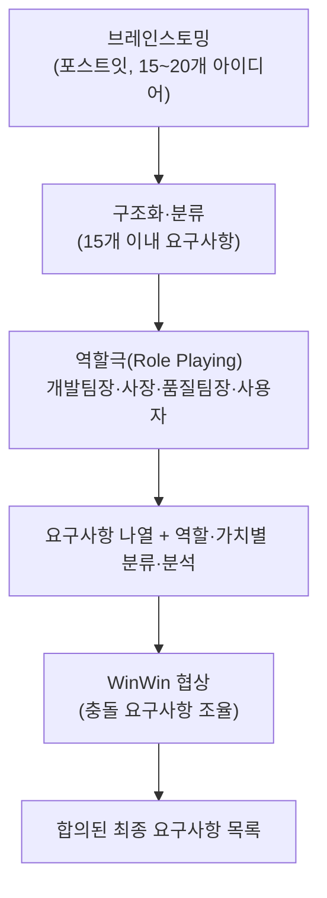

## 실습 1: 요구사항 도출 – 개요

- **요구사항 워크샵**을 수행해 봅시다.
  - (인증과제 대상) **AI 기반 카페 모바일 오더 및 픽업 알림 시스템** 구축 가정
  - **(1)** 요구사항 도출을 위한 **브레인스토밍** 수행
    - 포스트잇, 펜 등 이용
    - **15~20개** 정도 아이디어 도출
    - 구조화하고 분류하여 **15개 이내** 요구사항 도출
    - ChatGPT 등 생성형 AI 도구 활용 가능 (능동적 검토 필수, 최종 결정/책임은 사람)
  - 3-4가지 다른 역할의 역할극(**Role playing**) 수행
    - 예) 개발팀장, 기획/판매팀장(사장), 품질팀장, 동호회장(사용자)

### 이해당사자별 목표

| 이해당사자 (역할) | 목표 (Goals) |
|---|---|
| 개발팀장 | 개발노력 ↓ On Time ↑ 퇴사율 ↓ |
| 기획/판매팀장(사장) | 영업이익 ↑ 회사평판 ↑ |
| 품질팀장 | 품질 ↑ 테스트노력 ↓ |
| 동호회장(사용자) | 사용성 ↑ 편의성 ↑ 가격 ↓ |

- **(2)** 요구사항 협상 **(WinWin)** 수행
  - 요구사항을 나열
  - 역할과 가치를 고려하여 분류 및 분석
  - 요구사항 선정을 위한 협상 수행 - WinWin 표 활용
  - ChatGPT 등 생성형 AI 도구 활용 가능 (능동적 검토 필수, 최종 결정/책임은 사람)

## 실습 1: 요구사항 도출 – 산출물

- **어떤 요구사항을 도출해야 하는가?** — 이번 실습에서는 기능 요구사항·비기능 요구사항 **제한 없이** 도출한다 (둘 다 섞어서 나와도 됨, 개수 안배를 신경 쓸 필요 없음).
- 요구사항 도출 **과정**을 자유형식으로 제출 (텍스트파일, 그림파일 무관):
  1. **브레인스토밍 결과** — 도출된 초기 요구사항 집합 (15~20개 아이디어 → 구조화된 15개 이내)
  2. **협상 결과** — WinWin 분석표 (아래 템플릿 채운 것)
  3. **최종 합의된 요구사항 집합**

## 전체 흐름

## (1) 브레인스토밍 + 역할극 진행 절차

**브레인스토밍**

1. **아이디어 쏟아내기** — 팀원 각자 포스트잇에 떠오르는 요구사항(기능/비기능 무관)을 한 장에 하나씩 적는다. 이 단계에서는 **비판 금지** — 좋다/나쁘다 평가하지 않고 **15~20개**를 채우는 데 집중한다.
2. **화이트보드에 붙이기** — 적은 포스트잇을 전부 화이트보드에 붙인다.
3. **군집화(어피니티 다이어그램)** — 비슷한 내용의 포스트잇끼리 모아 묶는다.
4. **대표 항목으로 정리** — 각 군집을 대표하는 요구사항 하나로 다듬어, 최종적으로 **15개 이내**의 구조화된 요구사항 목록을 만든다.

**역할극(Role Playing)**

1. **역할 배정** — 위 이해당사자별 목표 표를 참고해서 팀원이 각자 역할(개발팀장/사장/품질팀장/사용자)을 맡는다. 3~4명이면 한 명씩, 인원이 적으면 한 사람이 여러 역할을 겸해도 된다.
2. **역할 관점으로 검토** — 브레인스토밍에서 나온 15개 이내 요구사항을 하나씩, 각자 맡은 역할의 목표(예: 사장은 "영업이익 ↑") 관점에서 "이게 나한테 이득인가/손해인가"를 발언하며 검토한다.
3. **충돌 지점 표시** — 역할 간 목표가 부딪히는 요구사항을 표시해 둔다 — 그게 다음 단계(WinWin 협상)의 협상 대상이 된다.
   - 예: "AI 추천 기능 고도화"는 사용자(편의성 ↑)·사장(회사평판 ↑)에겐 이득이지만, 개발팀장(개발노력 ↓)·품질팀장(테스트노력 ↓)에겐 부담.
4. **요구사항 나열 + 분류·분석** — 검토가 끝난 요구사항들을 역할·가치 기준으로 분류해 두면(예: "전원 찬성" / "일부 충돌") 다음 WinWin 협상에서 바로 어떤 항목부터 다뤄야 할지 알 수 있다.

## (2) 요구사항 협상 (WinWin) 진행 가이드

**WinWin 협상이란** — Barry Boehm이 제안한 요구사항 협상 기법으로, 이해당사자마다 원하는 것(목표)이 서로 다르고 때로 충돌할 때, "모두가 손해 보지 않고 이겼다고 느낄 수 있는" 합의점을 찾는 절차다. 한쪽이 일방적으로 밀어붙이는 협상이 아니라, 충돌 지점(Issue)마다 대안(Option)을 찾아 양쪽 목표를 절충한 합의(Agreement)에 도달하는 게 핵심이다.

**진행 절차**
1. **Win Condition 나열** — 역할극에서 나온 각 요구사항에 대해, 관련된 이해당사자가 "이게 있으면 내 목표에 도움이 된다"고 여기는 조건을 적는다.
2. **Issue(충돌) 식별** — 한 요구사항에 대해 서로 다른 역할의 Win Condition이 부딪히는 지점을 찾는다 (예: 사장은 "AI 기능 최대한 많이" vs 개발팀장은 "일정 내 완료").
3. **Option(대안) 제시** — 그 충돌을 절충할 수 있는 대안을 1~2개 제안한다 (예: "1차 출시엔 AI 추천 기본형만 포함, 고도화는 2차 업데이트로").
4. **Agreement(합의)** — 팀이 받아들일 대안을 확정하고, 그 결과를 "합의된 요구사항"으로 기록한다.

**WinWin 표 템플릿 (회의 중 채워 쓰기)**

| 요구사항 | 관련 이해당사자 (Win Condition) | Issue (충돌 지점) | Option (제안 대안) | Agreement (합의 결과) |
|---|---|---|---|---|
| (예: AI 추천 기능) | 사용자: 편의성↑ / 개발팀장: 개발노력↓ | 기능 범위가 넓을수록 사용자엔 이득, 개발팀엔 부담 | 1차엔 기본 추천만, 고도화는 2차로 분리 | 1차 출시 범위에 기본 추천만 포함하기로 합의 |
|  |  |  |  |  |

## 제출 체크리스트

- [ ] 브레인스토밍 결과 — 초기 요구사항 집합 (포스트잇 사진 또는 텍스트 정리, 15~20개 → 구조화된 15개 이내)
- [ ] 협상 결과 — WinWin 분석표 (위 템플릿에 실제 채운 결과)
- [ ] 최종 합의된 요구사항 집합

- 위 산출물은 사진/메모 어떤 형식이든 무방하며, 남겨 두면 [01_요구공학 실습](<../01_AI기반 카페 모바일 오더 및 픽업 알림 시스템 구축/단계별_가이드/01_요구공학.md>)의 FR/NFR/QAS 도출에 그대로 재사용할 수 있다.
- ChatGPT 등 생성형 AI 도구는 아이디어 확장이나 표현 다듬기에 보조로 쓰되, 최종적으로 어떤 요구사항을 채택할지는 팀이 능동적으로 검토하고 결정한다 (책임은 사람에게 있음).
